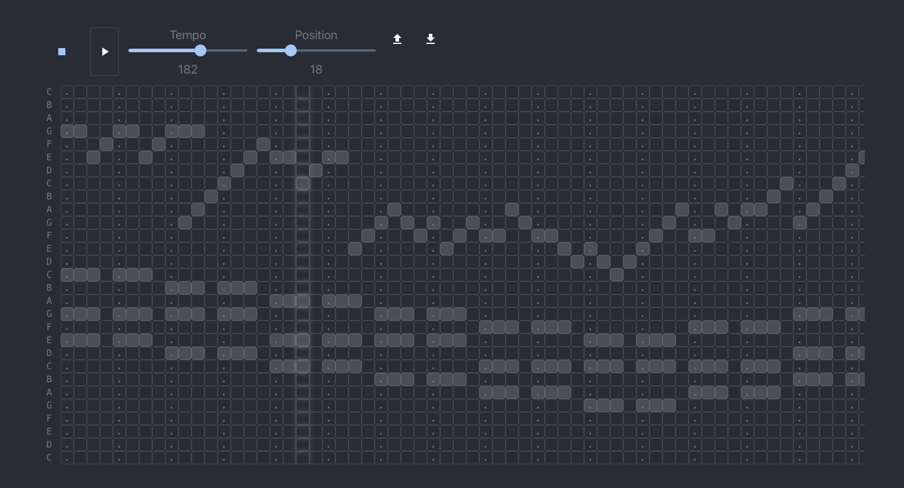

# Web Studio

> online music maker



[Demo video](./demo/canon-demo.mp4) (you may need to download to watch)

## Prerequisites

This project requires NodeJS (version 8 or later) and NPM.
[Node](http://nodejs.org/) and [NPM](https://npmjs.org/) are really easy to install.
To make sure you have them available on your machine,
try running the following command.

```sh
$ npm -v && node -v
8.1.2
v16.13.1
```

## Table of contents

- [Web Studio](#web-studio)
  - [Prerequisites](#prerequisites)
  - [Table of contents](#table-of-contents)
  - [Getting Started](#getting-started)
  - [Installation](#installation)
  - [Usage](#usage)
    - [Serving the app](#serving-the-app)
    - [Running the tests](#running-the-tests)
    - [Building a distribution version](#building-a-distribution-version)
  - [Contributing](#contributing)
  - [Credits](#credits)
  - [Built With](#built-with)
  - [License](#license)

## Getting Started

These instructions will get you a copy of the project up and running on your local machine for development and testing purposes. See deployment for notes on how to deploy the project on a live system.

## Installation

**BEFORE YOU INSTALL:** please read the [prerequisites](#prerequisites)

Start with cloning this repo on your local machine:

```sh
$ git clone https://github.com/sano-jin/web-studio.git
$ cd PROJECT
```

To install and set up the library, run:

```sh
$ npm install
```

## Usage

### Serving the app

```sh
$ npm start
```

### Running the tests

```sh
$ npm test
```

### Building a distribution version

```sh
$ npm run build
```

This task will create a distribution version of the project
inside your local `build/` folder

## Contributing

Please read [CONTRIBUTING.md](CONTRIBUTING.md) for details on our code of conduct, and the process for submitting pull requests to us.

1.  Fork it!
2.  Create your feature branch: `git checkout -b my-new-feature`
3.  Add your changes: `git add .`
4.  Commit your changes: `git commit -am 'Add some feature'`
5.  Push to the branch: `git push origin my-new-feature`
6.  Submit a pull request :sunglasses:

## Credits

This project was bootstrapped with [Create React App](https://github.com/facebook/create-react-app).

The Synth sound samples are obtained at <https://archive.org/details/SynthesizedPianoNotes>.

## Built With

- React
- Material UI
- TypeScript

## License

[MIT License](https://andreasonny.mit-license.org/2019) © Andrea SonnY
